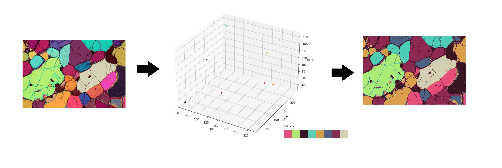

## Color Clustering segmentation applied to thin sections

Segmentation using KMeans of colors in a given thin section image (olivine) and visualization of colors and clusters in 3D.

Clustering with KMeans, 3D visualization of clusters (R, G, B axes) and compressed image.

