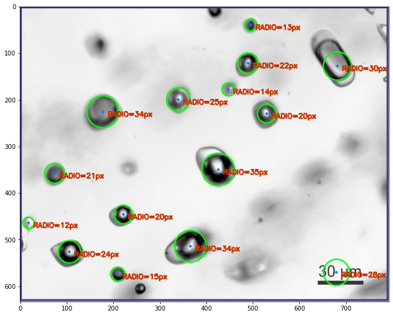

## DigitalPetrography

Functions to process thin section images with canny edge detection filter, hough line transform and hough circles transform. Aditionally I have left the jupyter notebooks (.ipynb) with interactivity so anyone can play with the parameters given to the functions

Funciones para procesar imagenes de secciones delgadas con el filtro de deteccion de bordes "Canny", la transformada de Hough para lineas y para círculos. Adicionalmente se deja interactividad en los jupyter notebooks (.ipynb)

### Inclusion Detection

Using Hough circle detection algorithm to find fluid inclusions in thin sections and extract its radius.

### Pore Segmentation

Streamlit app to color segmentate thin sections and in this case, blue for pores, try to find its porosity by finding the percentage of blue regions in thin sections. It also may have other uses in accounting for alteration area and general segmentation (clustering, KMeans) by color on thin sections.

