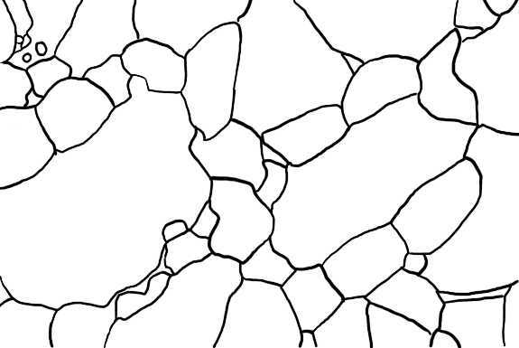
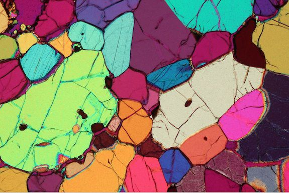

## SLIC Border detection and grain counting in thin section 

In this notebook, experiments using the SLIC (Simple linear iterative clustering) algorithm are performed to check his efficiency against a base (human drawn) true of border and grain numbers in the "olivino.jpg" thin section (base true is "gt-olivino.jpg")

### Base true borders

### Original Images

